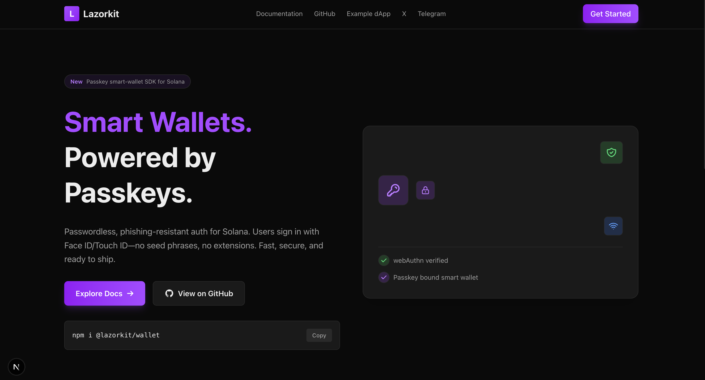
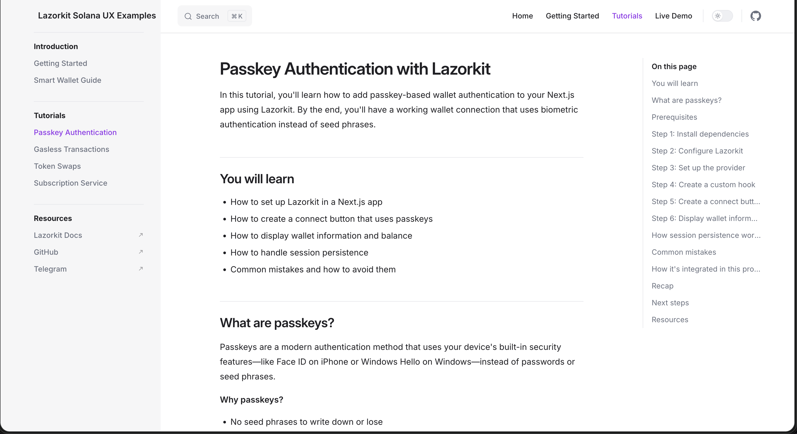
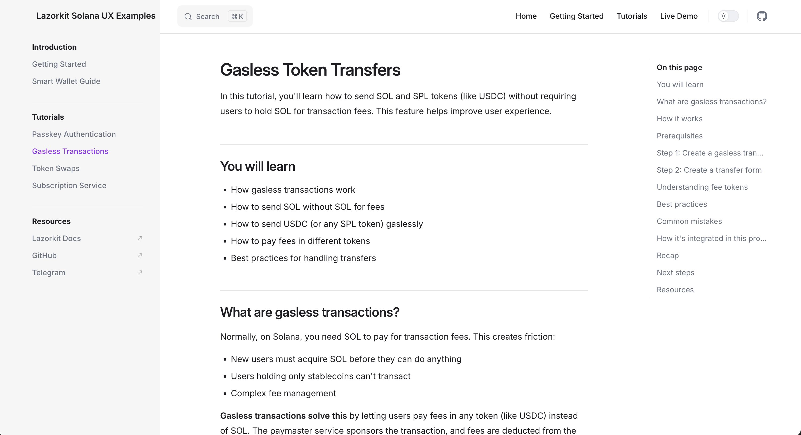
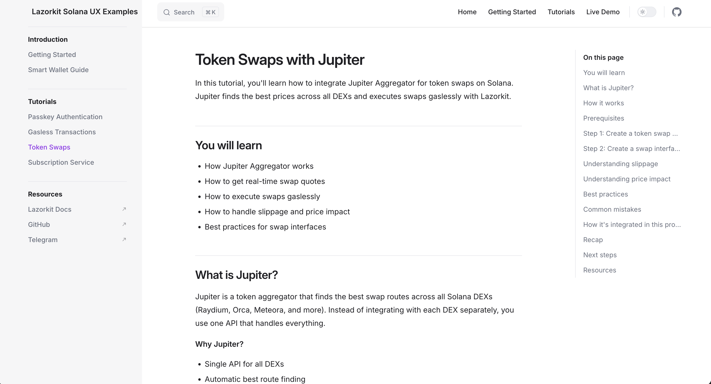
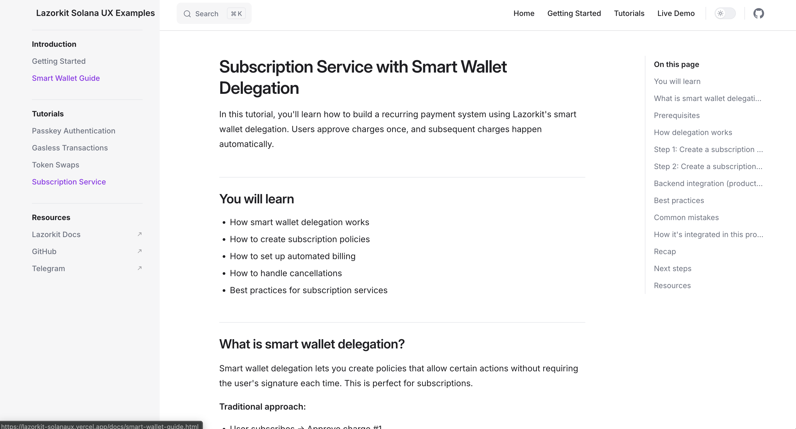
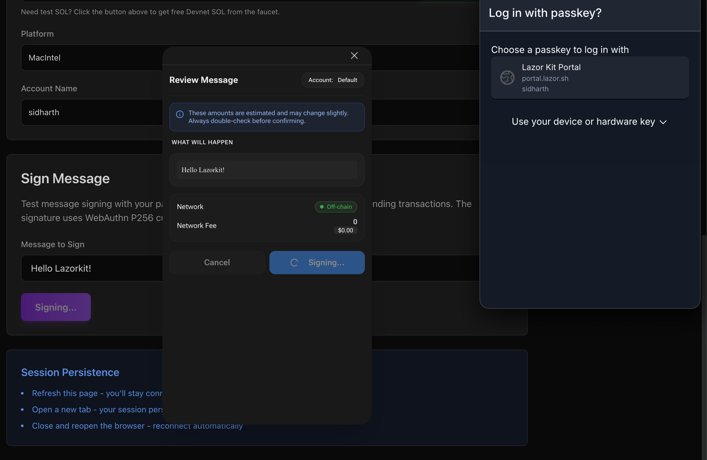
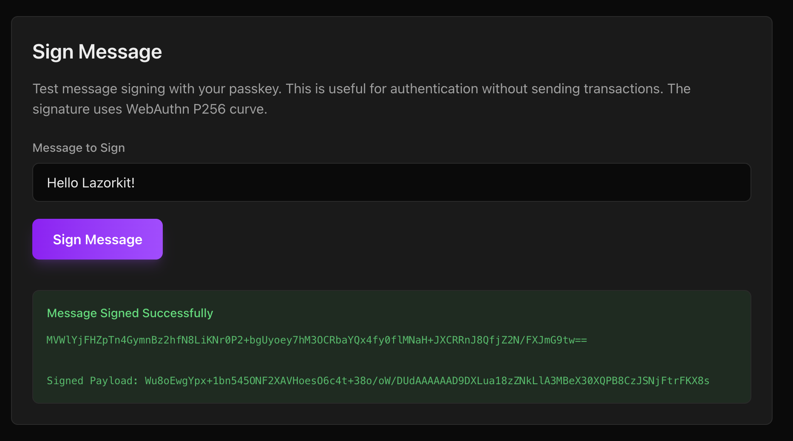
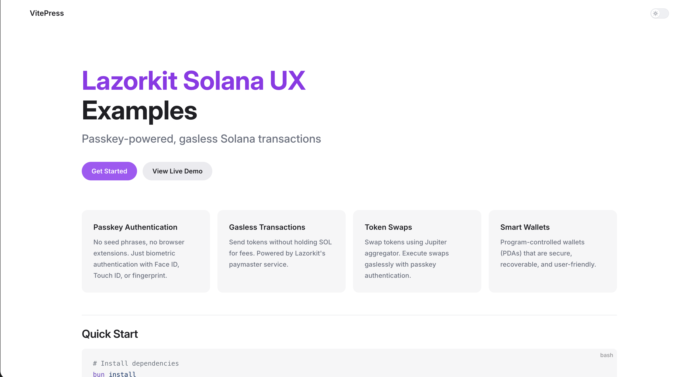
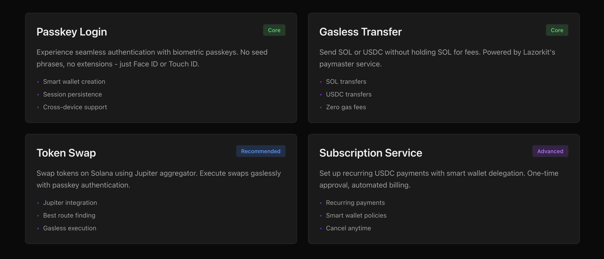

# Lazorkit Solana UX

**Passkey-powered, gasless Solana dApp examples built with Next.js**

A production-ready starter template showing how Lazorkit removes the friction from Solana UX — no seed phrases, no browser extensions, no SOL required for gas.

[](https://lazorkit-solanaux.vercel.app)
[](https://lazorkit-solanaux.vercel.app/docs)
[](https://explorer.solana.com/?cluster=devnet)
[](https://docs.lazorkit.com/)
[](#license)



---

## Why Lazorkit?

| Traditional Solana UX | With Lazorkit |
|----------------------|---------------|
| Seed phrases to manage | Face ID / Touch ID authentication |
| Browser extensions required | Works directly in the browser |
| Users must buy SOL for gas | Gasless transactions via paymaster |
| Manual transaction signing | One-click approval |
| Complex wallet setup | Smart wallet created on first login |

---

## Examples

| # | Example | Description | Docs |
|---|---------|-------------|------|
| 01 | [Passkey Login](app/passkey-login) | Biometric auth, smart wallet creation, message signing | [Tutorial](./tutorials/passkey-wallet.md) |
| 02 | [Gasless Transfer](app/gasless-transfer) | Send SOL and SPL tokens without holding SOL | [Tutorial](./tutorials/gasless-tx.md) |
| 03 | [Token Swap](app/token-swap) | Jupiter aggregator swaps with gasless execution | [Tutorial](./tutorials/token-swap.md) |
| 04 | [Subscription](app/subscription) | Recurring payments via smart wallet delegation | [Tutorial](./tutorials/subscription.md) |

<details>
<summary><b>Screenshots</b></summary>

| Passkey Authentication | Gasless Transactions |
|---|---|
|  |  |

| Token Swap | Subscription Service |
|---|---|
|  |  |

| Message Signing — Step 1 | Message Signing — Step 2 |
|---|---|
|  |  |

| Documentation | Step-by-Step Guides |
|---|---|
|  |  |

</details>

---

## Quick Start

**Prerequisites:** Bun 1.0+ (or Node.js 18+) and a browser with WebAuthn support.

```bash
git clone https://github.com/sidharthpunathil/lazorkit-solanaux.git
cd lazorkit-solanaux
bun install
cp .env.example .env.local
bun run docs:build   # builds VitePress docs into public/docs/
bun run dev
```

Open [http://localhost:3000](http://localhost:3000) — docs at [/docs](http://localhost:3000/docs).

The defaults work against Solana Devnet out of the box. Only the Jupiter API key needs to be added for swaps.

---

## Configuration

| Variable | Description | Default |
|----------|-------------|---------|
| `NEXT_PUBLIC_RPC_URL` | Solana RPC endpoint | `https://api.devnet.solana.com` |
| `NEXT_PUBLIC_PORTAL_URL` | Lazorkit portal URL | `https://portal.lazor.sh` |
| `NEXT_PUBLIC_PAYMASTER_URL` | Paymaster service URL | `https://kora.devnet.lazorkit.com` |
| `NEXT_PUBLIC_PAYMASTER_API_KEY` | Paymaster API key (optional) | — |
| `NEXT_PUBLIC_JUPITER_API_KEY` | Jupiter API key (required for swaps) | — |

**Jupiter API key:** grab a free one at [portal.jup.ag](https://portal.jup.ag) (60 req/min). This project uses the current `api.jup.ag/swap/v1` endpoint, which requires a key.

**Network switching:** a toggle in the header switches between Devnet and Mainnet. The choice persists in `localStorage` and updates RPC endpoints, paymaster URLs, token mints, and explorer links. Reconnect your wallet after switching — smart wallet addresses are network-specific.

**Custom RPC:** for better reliability, point `NEXT_PUBLIC_RPC_URL` at [Helius](https://helius.dev), [QuickNode](https://quicknode.com), or [Alchemy](https://www.alchemy.com).

---

## Documentation

This repo has **three layers of documentation**:

| Layer | Location | Purpose |
|-------|----------|---------|
| **Live Docs** | [`/docs`](https://lazorkit-solanaux.vercel.app/docs) | VitePress site, built into the Next.js app |
| **Tutorials** | [`tutorials/`](./tutorials) | Step-by-step walkthroughs with full code for each example |
| **Smart Wallet Guide** | [`SMART_WALLET_GUIDE.md`](./SMART_WALLET_GUIDE.md) | What a smart wallet is, how it's created, how to fund it |

The VitePress docs build into `public/docs/` and are served by Next.js at `/docs` — no separate server. Run `bun run docs:build` after editing anything under `docs/`.

---

## Project Structure

```
lazorkit-solanaux/
├── app/                    # Next.js App Router pages
│   ├── page.tsx            # Home page (navigation hub)
│   ├── passkey-login/      # Passkey authentication demo
│   ├── gasless-transfer/   # Gasless token transfers
│   ├── token-swap/         # Jupiter swap interface
│   └── subscription/       # Subscription billing demo
├── components/             # Reusable React components
├── lib/
│   ├── config/             # Lazorkit SDK configuration
│   ├── hooks/              # useLazorkitWallet, useGaslessTransfer, useTokenSwap
│   ├── store/              # Zustand wallet store
│   └── utils/              # Error handling helpers
├── docs/                   # VitePress source (builds to public/docs/)
└── tutorials/              # Step-by-step guides
```

---

## Live Demo

**[https://lazorkit-solanaux.vercel.app](https://lazorkit-solanaux.vercel.app)**

**Testing on Devnet:**

1. Create a wallet with Face ID / Touch ID / fingerprint
2. Get devnet SOL from the [Solana Faucet](https://faucet.solana.com)
3. Get devnet USDC from the [Circle Faucet](https://faucet.circle.com)
4. Try the examples

---

## Tech Stack

| Category | Technology |
|----------|------------|
| Framework | Next.js 16, React 19 (App Router) |
| Language | TypeScript |
| Styling | Tailwind CSS 4 |
| State | Zustand |
| Blockchain | Solana (`@solana/web3.js`, `@solana/spl-token`) |
| Wallet SDK | LazorKit 2.0.1 |
| Swaps | Jupiter Aggregator API v1 |
| Docs | VitePress |
| Package Manager | Bun (recommended) |

---

## Key Concepts

**Smart wallets** — Lazorkit derives a PDA smart wallet per user. It's controlled by your passkey, supports gasless transactions, can delegate permissions for recurring payments, and follows you across devices.

**Gasless transactions** — the paymaster sponsors network fees, so users can send tokens without holding SOL and pay fees in USDC instead.

---

## Development

```bash
bun run type-check   # TypeScript
bun run lint         # ESLint
bun run format       # Prettier
```

## Deployment

Configured for Vercel out of the box. The `prebuild` script runs `docs:build` before `next build`, so the VitePress docs ship with every deploy. Push to GitHub, import the project in [Vercel](https://vercel.com), and deploy — env vars are optional for Devnet.

See [DEPLOYMENT.md](./DEPLOYMENT.md) for detailed instructions and troubleshooting. Any Next.js host works (Netlify, Railway, AWS Amplify, self-hosted).

---

## Bounty Submission

Built for the [Superteam Vietnam x Lazorkit Bounty](https://earn.superteam.fun/listing/integrate-passkey-technology-with-lazorkit-to-10x-solana-ux).

**Deliverables:**
- 4 working examples with full tutorials
- Live demo on Solana Devnet with Mainnet toggle
- VitePress documentation site served at `/docs`
- Reusable hooks and components as a starter template

---

## Resources

- [Lazorkit Documentation](https://docs.lazorkit.com) · [GitHub](https://github.com/lazor-kit/lazor-kit) · [Telegram](https://t.me/lazorkit)
- [Solana Documentation](https://docs.solana.com)
- [Jupiter Aggregator](https://jup.ag) · [API Portal](https://portal.jup.ag) · [API Docs](https://dev.jup.ag/docs/apis/swap-api)

---

## Author

**Sidharth P** — [GitHub](https://github.com/sidharthpunathil)

## License

MIT License — feel free to use this as a starting point for your own projects.
